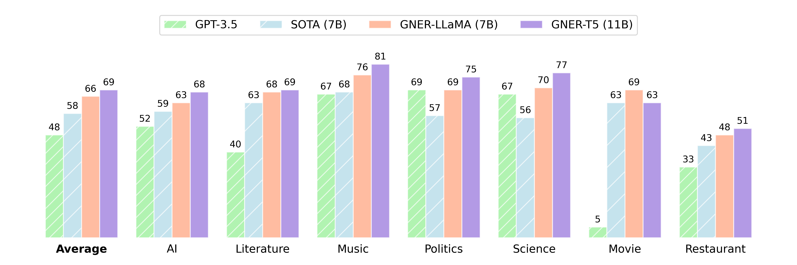

<p align="center"><h2 align="center">Rethinking Negative Instances for Generative Named Entity Recognition</h2></p>

<p align="center">
    <a href="https://github.com/yyDing1/GNER/blob/main/LICENSE"></a>
    <a href="https://huggingface.co/collections/dyyyyyyyy/gner-65dda2cb96c6e35c814dea56"></a>
    <a href="https://arxiv.org/abs/2402.16602"></a>
    <a href="https://opennlg.cn/"></a>
</p>

We introduce GNER, a **G**enerative **N**amed **E**ntity **R**ecognition framework, which demonstrates enhanced zero-shot capabilities across unseen entity domains. Experiments on two representative generative models, i.e., LLaMA and Flan-T5, show that the integration of negative instances into the training process yields substantial performance enhancements. The resulting models, GNER-LLaMA and GNER-T5, outperform state-of-the-art (SoTA) approaches by a large margin, achieving improvements of 8 and 11 points in $F_1$ score, respectively. Code and models are publicly available.

* 📖 Paper: [Rethinking Negative Instances for Generative Named Entity Recognition](https://arxiv.org/abs/2402.16602)
* 💾 Models in the 🤗 HuggingFace Hub: [GNER-Models](https://huggingface.co/collections/dyyyyyyyy/gner-65dda2cb96c6e35c814dea56)
* 🔁 Reproduction Materials: [Materials](https://drive.google.com/drive/folders/1m2FqDgItEbSoeUVo-i18AwMvBcNkZD46?usp=drive_link)

<p align="center">

</p>

## PreTrained Models

We release five GNER models based on LLaMA (7B) and Flan-T5 (base, large, xl and xxl).

| Model         | # Params | Zero-shot Average$F_1$ | Supervised Average$F_1$ |          🤗 HuggingFace<br />Download Link          |
| ------------- | -------: | :----------------------: | :-----------------------: | :-------------------------------------------------: |
| GNER-LLaMA    |       7B |           66.1           |           86.09           | [link](https://huggingface.co/dyyyyyyyy/GNER-LLaMA-7B) |
| GNER-T5-base  |     248M |           59.5           |           83.21           | [link](https://huggingface.co/dyyyyyyyy/GNER-T5-base) |
| GNER-T5-large |     783M |           63.5           |           85.45           | [link](https://huggingface.co/dyyyyyyyy/GNER-T5-large) |
| GNER-T5-xl    |       3B |           66.1           |           85.94           |  [link](https://huggingface.co/dyyyyyyyy/GNER-T5-xl)  |
| GNER-T5-xxl   |      11B |           69.1           |           86.15           |  [link](https://huggingface.co/dyyyyyyyy/GNER-T5-xxl)  |

## Demo usage

GNER-LLaMA:

```python
>>> import torch
>>> from transformers import AutoTokenizer, AutoModelForCasualLM
>>> tokenizer = AutoTokenizer.from_pretrained("dyyyyyyyy/GNER-LLaMA-7B")
>>> model =AutoModelForCasualLM.from_pretrained("dyyyyyyyy/GNER-LLaMA-7B", torch_dtype=torch.bfloat16).cuda()
>>> model = model.eval()
>>> instruction_template = "Please analyze the sentence provided, identifying the type of entity for each word on a token-by-token basis.\nOutput format is: word_1(label_1), word_2(label_2), ...\nWe'll use the BIO-format to label the entities, where:\n1. B- (Begin) indicates the start of a named entity.\n2. I- (Inside) is used for words within a named entity but are not the first word.\n3. O (Outside) denotes words that are not part of a named entity.\n"
>>> sentence = "did george clooney make a musical in the 1980s"
>>> entity_labels = ["genre", "rating", "review", "plot", "song", "average ratings", "director", "character", "trailer", "year", "actor", "title"]
>>> instruction = f"{instruction_template}\nUse the specific entity tags: {', '.join(entity_labels)} and O.\nSentence: {sentence}"
>>> instruction = f"[INST] {instruction} [/INST]"
>>> inputs = tokenizer(instruction, return_tensors="pt").to("cuda")
>>> outputs = model.generate(**inputs, max_new_tokens=640)
>>> response = tokenizer.decode(outputs[0], skip_special_tokens=True)
>>> response = response[preds.find("[/INST]") + len("[/INST]"):].strip()
>>> print(response)
"did(O) george(B-actor) clooney(I-actor) make(O) a(O) musical(B-genre) in(O) the(O) 1980s(B-year)"
```

GNER-T5:

```python
>>> import torch
>>> from transformers import AutoTokenizer, AutoModelForSeq2SeqLM
>>> tokenizer = AutoTokenizer.from_pretrained("dyyyyyyyy/GNER-T5-xxl")
>>> model = AutoModelForSeq2SeqLM.from_pretrained("dyyyyyyyy/GNER-T5-xxl", torch_dtype=torch.bfloat16).cuda()
>>> model = model.eval()
>>> instruction_template = "Please analyze the sentence provided, identifying the type of entity for each word on a token-by-token basis.\nOutput format is: word_1(label_1), word_2(label_2), ...\nWe'll use the BIO-format to label the entities, where:\n1. B- (Begin) indicates the start of a named entity.\n2. I- (Inside) is used for words within a named entity but are not the first word.\n3. O (Outside) denotes words that are not part of a named entity.\n"
>>> sentence = "did george clooney make a musical in the 1980s"
>>> entity_labels = ["genre", "rating", "review", "plot", "song", "average ratings", "director", "character", "trailer", "year", "actor", "title"]
>>> instruction = f"{instruction_template}\nUse the specific entity tags: {', '.join(entity_labels)} and O.\nSentence: {sentence}"
>>> inputs = tokenizer(instruction, return_tensors="pt").to("cuda")
>>> outputs = model.generate(**inputs, max_new_tokens=640)
>>> response = tokenizer.decode(outputs[0], skip_special_tokens=True)
>>> print(response)
"did(O) george(B-actor) clooney(I-actor) make(O) a(O) musical(B-genre) in(O) the(O) 1980s(B-year)"
```

## Task schema: Incorporating negative instances into training

<p align="center">

</p>

## Hierarchical Matching: A faster algorithm for structuring

We develop a Hierarchical Matching algorithm that provides a straightforward and effective solution to the omission, addition, and substitution problems in the structuring process.

Furthermore, we implement a fast version of the LCS algorithm within $O(N\log N)$, based on the nature of the small number of duplicate words in the query sentence.

First, we transform the Longest Common Subsequence (LCS) problem into a Longest Increasing Subsequence (LIS) problem. Subsequently, we construct a Directed Acyclic Graph (DAG) to facilitate the traceback of the specific sequence.

```python
# A fast version of LCS with a complexity of O(NlogN)
# in the condiction that there are few depulicate words in the sentence
# input: a = [word_1, word_2, ..., word_n], b = [word_1, word_2, ..., word_m]
# return: match_idx = [idx_1, idx_2, ..., idx_n] (correspoding matching index between a and b)
def lcs_solve_fast(a, b):
    n, m = len(a), len(b)
    match_idx = [-1] * n
    match_list_b = defaultdict(list)
  
    # First we can convert the LCS problem into a LIS problem,
    # i.e., LCS(a, b) <=> LIS(index_list)
    for idx, word in enumerate(reversed(b)):
        match_list_b[word].append(m - idx - 1)
    index_list = []
    elem_list = []
    for idx, word in enumerate(a):
        if word in match_list_b:
            index_list.extend(match_list_b[word])
            elem_list.extend([idx] * len(match_list_b[word]))

    # then we compute the longest increasing subsequence of index_list
    # we compute a dag, the edges array store the parent of the node, and path store the results
    father, increasing_seq = [[(-1, -1, -1)]], [-1]
    for i in range(len(index_list)):
        if index_list[i] > increasing_seq[-1]:
            father.append([(len(father[-1]) - 1, i, index_list[i])])
            increasing_seq.append(index_list[i])
        else:
            # binary search
            l, r, query_idx = 0, len(increasing_seq) - 1, -1
            while l <= r:
                mid = (l + r) >> 1
                if increasing_seq[mid] >= index_list[i]:
                    query_idx = mid
                    r = mid - 1
                else:
                    l = mid + 1
            father[query_idx].append((len(father[query_idx - 1]) - 1, i, index_list[i]))
            increasing_seq[query_idx] = index_list[i]

    # finally, we trace back the path to get a solution of the original LCS problem
    i, j = len(father) - 1, len(father[-1]) - 1
    while i > 0:
        match_idx[elem_list[father[i][j][1]]] = father[i][j][2]
        j = father[i][j][0]
        i -= 1
    return match_idx
```

## How to use GNER

### Requirements

You should install the dependencies:

```bash
pip install torch>=2.1.0 datasets>=2.17.0 deepspeed>=0.13.4 accelerate>=0.27.2 transformers>=4.38.1 protobuf>=4.25.3 
```

### Quick Reproduction

We also provide all the generated results for quick reproduction of our results. The `model_predictions` folder contains the generated results of GNER-LLaMA-7B and GNER-T5-xxl (including the ground truth). You can execute the following commands to evaluate the generated results:

```python
# 0shot performance of GNER-LLaMA
python evaluate.py --tokenizer-path yahma/llama-7b-hf --prediction-path prediction_results/llama-7b-task-adaptation-beam1.jsonl
# 0shot performance of GNER-T5-xxl
python evaluate.py --tokenizer-path google/flan-t5-xxl --prediction-path prediction_results/flan-t5-xxl-task-adaptation-beam1.jsonl
```

Other generated results can be found at [here](https://drive.google.com/drive/folders/1kg7YDRk8jK4_Bo19jJpZtdAQMBoucppW?usp=drive_link), and the execution process is similar to the two examples mentioned above.

### Training & Inference

First, you should download the training data from [here](https://drive.google.com/drive/folders/1jJsqDhR8Pdg4Qlh5pHm0WZ6Nsk1wEcv9?usp=drive_link), put it in the current directory and rename it as `data`

The training scripts are outlined in folder `scripts`, you can train and evaluate the model by the following command:

```bash
# Train and evaluate LLaMA Model
bash scripts/train_llama_task_adaptation.sh
# Evaluate only
bash scripts/eval_llama_task_adaptation.sh

# Train T5 xxl Model
bash scripts/train_t5_xxl_task_adaptation.sh
# Evaluate only
bash scripts/eval_t5_task_adaptation.sh
```

## Citation

```bibtex
@misc{ding2024rethinking,
      title={Rethinking Negative Instances for Generative Named Entity Recognition}, 
      author={Yuyang Ding and Juntao Li and Pinzheng Wang and Zecheng Tang and Bowen Yan and Min Zhang},
      year={2024},
      eprint={2402.16602},
      archivePrefix={arXiv},
      primaryClass={cs.CL}
}
```
